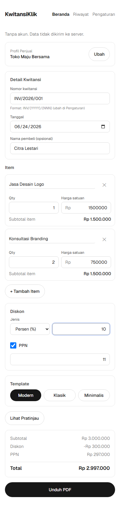

# KwitansiKlik

> Pembuat kwitansi digital **gratis & open source** — bikin kwitansi profesional dalam hitungan detik, **tanpa perlu daftar akun**.

KwitansiKlik membantu UMKM, freelancer, dan siapa pun di Indonesia membuat kwitansi/bukti pembayaran yang rapi: masukkan item & harga → dapat PDF → selesai. Tanpa login, tanpa email, tanpa server — semua diproses **di browser kamu** (client-side), jadi datamu tidak ke mana-mana. Bisa di-install ke layar utama dan **jalan penuh tanpa internet**.

**Live demo:** [kwitansiklik.vercel.app](https://kwitansiklik.vercel.app)



## ✨ Kenapa KwitansiKlik

- **Tanpa daftar akun** — buka, bikin, unduh. Nol friksi.
- **Privasi maksimal** — arsitektur client-side; data kwitansi & profil disimpan lokal di perangkat (localStorage), tidak dikirim ke server.
- **PDF profesional, 3 pilihan template** — Modern, Klasik (terbilang + tanda tangan), Minimalis — di-generate di browser dengan [`@react-pdf/renderer`](https://react-pdf.org/) (PDF vektor, tajam).
- **Mobile-first & PWA** — installable ke home screen dan berfungsi **offline penuh**, termasuk membuat & mengunduh PDF.
- **Open source (AGPL-3.0)** — transparan dan gratis selamanya untuk fitur inti.

## 🧱 Tech Stack

| Layer             | Teknologi                                            |
| ----------------- | ---------------------------------------------------- |
| Framework         | Next.js (App Router, Turbopack) + React + TypeScript |
| Styling           | Tailwind CSS                                         |
| PDF               | `@react-pdf/renderer` (client-side)                  |
| PWA / Offline     | `@serwist/turbopack` (service worker)                |
| Persistensi (MVP) | `localStorage` (tanpa backend/DB)                    |
| Test              | Vitest                                               |
| Hosting           | Vercel                                               |

Arsitektur lengkap & alasan keputusan ada di [`docs/ADR-KwitansiKlik.md`](docs/ADR-KwitansiKlik.md).

## 🚀 Menjalankan Secara Lokal

Butuh **Node.js 18.18+** (disarankan Node 20/22+).

```bash
# 1. Install dependency
npm install

# 2. Jalankan dev server
npm run dev
```

Buka [http://localhost:3000](http://localhost:3000) di browser.

### Analytics (opsional)

Proyek ini mendukung [Plausible Analytics](https://plausible.io) (tanpa cookie, privasi-friendly) secara **opt-in**. Default-nya tidak mengirim apa pun. Untuk mengaktifkan, salin `.env.example` ke `.env.local` dan isi domain Plausible-mu:

```bash
cp .env.example .env.local
# lalu isi NEXT_PUBLIC_PLAUSIBLE_DOMAIN=domainmu.com
```

### Skrip yang tersedia

| Perintah               | Fungsi                               |
| ---------------------- | ------------------------------------ |
| `npm run dev`          | Dev server (hot reload)              |
| `npm run build`        | Build produksi                       |
| `npm run start`        | Jalankan hasil build produksi        |
| `npm run lint`         | Cek lint (ESLint)                    |
| `npm run typecheck`    | Cek tipe TypeScript (`tsc --noEmit`) |
| `npm run format`       | Format kode dengan Prettier          |
| `npm run format:check` | Cek format tanpa mengubah file       |
| `npm run test`         | Jalankan unit test (Vitest)          |
| `npm run test:watch`   | Unit test mode watch                 |

## 🗺️ Roadmap

MVP dibangun bertahap (detail di [`docs/MVP-Build-Plan-KwitansiKlik.md`](docs/MVP-Build-Plan-KwitansiKlik.md)):

- [x] **Fase 0** — Setup & fondasi
- [x] **Fase 1** — Data layer & logika inti (kalkulasi, nomor kwitansi, terbilang)
- [x] **Fase 2** — PDF spike (`@react-pdf/renderer`)
- [x] **Fase 3** — Form input UI (mobile-first)
- [x] **Fase 4** — Profil & riwayat (localStorage)
- [x] **Fase 5** — Tiga template + selector
- [x] **Fase 6** — PWA (installable + offline)
- [x] **Fase 7** — Polish & launch

Konteks produk & strategi: [`docs/PRD-KwitansiKlik.md`](docs/PRD-KwitansiKlik.md).

## 🤝 Kontribusi

Kontribusi sangat diterima — lihat [`CONTRIBUTING.md`](CONTRIBUTING.md) untuk cara setup, konvensi kode, dan checklist sebelum mengirim PR. Bug/ide silakan buka di [issues](https://github.com/sholllll662/kwitansiklik/issues).

## 📄 Lisensi

Dilisensikan di bawah **GNU Affero General Public License v3.0 (AGPL-3.0)** — lihat [`LICENSE`](LICENSE). Singkatnya: bebas dipakai, dipelajari, dimodifikasi, dan didistribusikan, dengan syarat karya turunan (termasuk yang dijalankan sebagai layanan jaringan) tetap open source di bawah lisensi yang sama.
